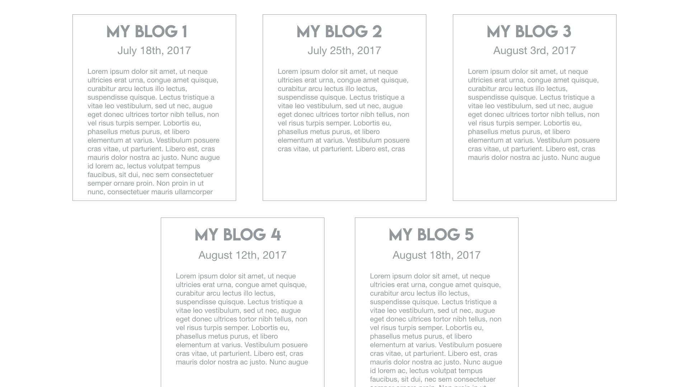

# Personal Bio Site 3: Adding A Blog Page (CSS - Flexbox)

## Prerequisite

> :warning: This exercise requires you to have completed the [Personal Bio Site 2: Interactive Navigation (CSS)
](personal-bio-site-2.md) exercise

### You will be working off of your previous iteration of your Personal Bio site.

## Requirements

1. Create 1 new HTML page: Blog
1. Add a link to this blog page in your existing navigation.
1. Create at least 5 blog entry "cards" for now. Each card should have:
   * A header section containing an H4 title and the date the blog was written.
   * A content section containing your body of text. _These entries should be themed around your journey into development. As you discover new tricks, tips and tools, write about your discovery. Write about what you have tried and why it did or did not work. These entries will be helpful for you as you speak with other members of the development community (and will be helpful when you are frustrated - look how far you've come). For now, you can use placeholder text, but this should be your place to continue writing throughout this course._
1. Your page should follow this mockup. Use Flexbox to achieve this:

