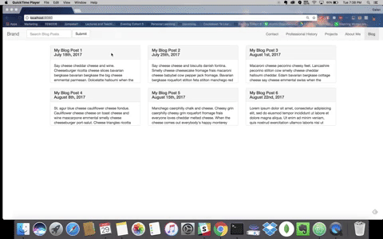

# Personal Bio Site 6: Bootstrapping Your Personal Bio Site (Bootstrap)

## Prerequisite

> :warning: This exercise requires you to have completed the [Personal Bio Site 5: Using JSON/XHR to write your blog articles to the DOM (JS - XHR)](personal-bio-site-5.md) exercise.

### You will be working off of your previous iteration of your Personal Bio site.

## Requirements

1. Open your main.js file and blog.html.
1. Grid System: Use the grid system to display your blog entries. You should have 3 blog articles per row.
1. Bootstrap Nav Bar: Should contain 3 elements: 
    1. Your "Logo" or personal bio site title
    1. Input bar to search your blog posts (Logic specs for this in a later step). NOTE: This should **only be visible** from the Nav Bar on your Blog Page.
    1. All of the links to your other pages on your website
1. Blog Page
    - The elements on this page should utilize the full width of the screen.
    - Update each of your blog posts so they all have a set height. Cut off any of the text that expands beyond the set height using some CSS. (Hint: checkout the overflow property).
    - Whenever the user clicks on a specific blog post card, that blog should appear in a special div (that spans all 12 columns) above all of the blog posts and should show the full content of the blog. When the user clicks on another blog post, it should replace the content of this special div with the content of the new blog post the user selected.

    **Bonus**: Search
    - Whenever the user types in the search bar, it should filter the blog posts. EG: The user types in "abou", the only remaining blog cards showing should be ones where your content contains the string "abou" somewhere. 
    - Add an array of "tags" to each of your blog post entries. These can be displayed on the card or not, your choice. Make it so the search function only applies to these tags. EG: The user types in "func", the only remaining blog cards showing should be ones where your tags array contains the string "func" at some index in the array.

## Final Result

